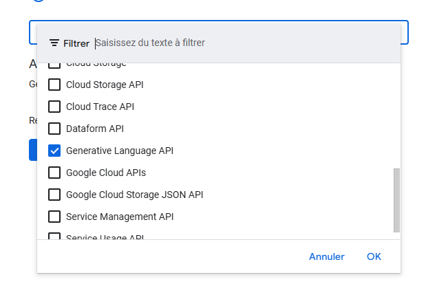

# Social Opinions
Extension Chrome qui permet une analyse rapide des opinions et tendances dans les commentaires d'un post Reddit et X à l'aide de l'IA Gémini.

# /!\ Projet "Vibe coding" /!\
Ce projet est un essai pour tester Windsurf : je n'ai écris que des prompts et aucune ligne de code.
Après quelques essais, j'ai décidé de rester sur Claude 3.7 sonnet et récemment j'ai ajouté 2 MCP :
- sequential-thinking
- playwright

Les autres modèles n'ont produit que du code non-fonctionnel et inutilement ambigu.
J'ai décidé de ne pas prendre la version "thinking" de Claude 3.7 après quelques essais, 
car celui-ci avait tendance à se perdre et à engranger tellement de contexte que cela semblait le rendre inopérant.

## API keys
J'ai autorisé l'IA à écrire mes API keys en clair dans le code pour faciliter les itérations du dev, 
perdez pas votre temps à tenter, j'ai tout révoqué ;)

Pour faire fonctionner cette extension donc, il vous faudra une clé API Gémini avec le scope "Generative language API".

https://console.cloud.google.com/apis/credentials/key

